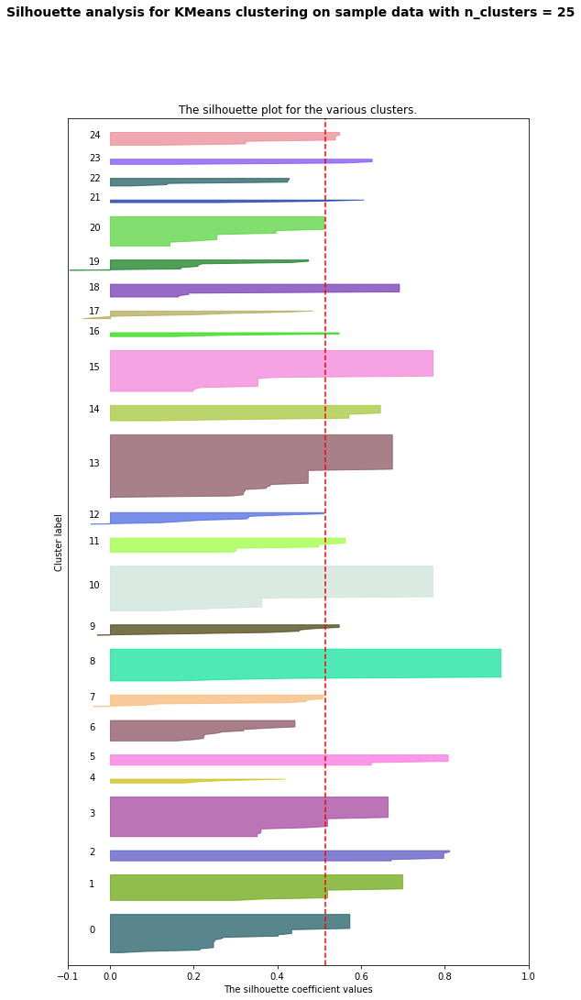

## ml assignment 3: clustering image meta-data

### data

After testing out different combinations of provided metadata, I decided to cluster the images based on these five:
* art_movement
* primary_medium
* representation
* spatial_dimension
* has_text

 For the data points with boolean values, I used the following to transform them into binary (0, 1) values:
 ```
 data['has_text'] = data['has_text'].astype(int)
 ```

 For art_movement and primary_medium, I initially counted the number of letters in the str. Later, I assigned each value in the data with a unique number:
```
primary_mediums = {}
int = 0

for primary_medium in data['primary_medium'].values:   
    if primary_medium in primary_mediums:
        primary_medium = primary_mediums[primary_medium]
    else:
        primary_mediums[primary_medium] = int
        int += 1

data['primary_medium'] = [primary_mediums[item] for item in data['primary_medium']]
```

### KMeans


I chose the number of clusters with groupings that made the most sense to me. In this case that happened to be 25 clusters.

A visualization of the clusters can be referenced in the notebook.
